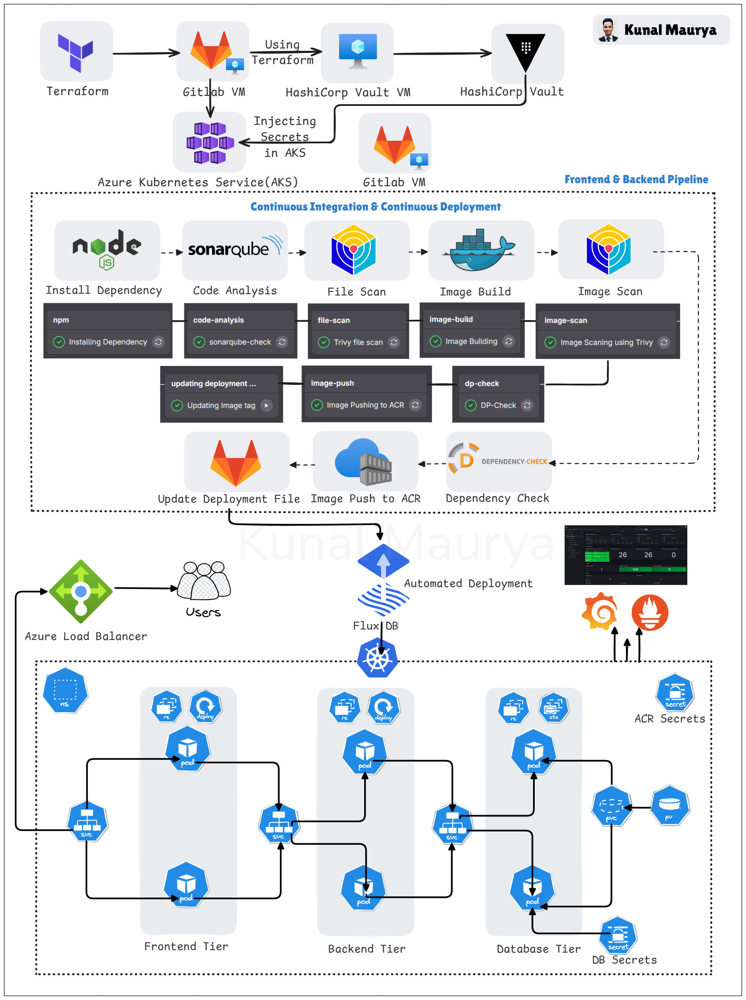

# End-to-End Azure DevSecOps Project

This repository implements a secure, scalable, and observable three-tier application on Azure Kubernetes Service (AKS). It uses Terraform for infrastructure, HashiCorp Vault for secrets, GitLab CI/CD with Trivy and SonarQube for secure pipelines, FluxCD with Kustomize for GitOps, and Prometheus with Grafana for monitoring.

Detailed setup instructions are in the [project blog](https://kunalmaurya.hashnode.dev/advanced-devsecops-end-to-end-three-tier-kubernetes-on-aks-with-fluxcd-grafana-and-prometheus) (Advanced DevSecOps: End-to-End Three-Tier Kubernetes on AKS).

## Architecture Diagram

The architecture diagram below illustrates the flow from infrastructure provisioning to CI/CD, GitOps, and monitoring:

## Component Highlights

### 🏗️ Infrastructure Layer
- **Azure AKS**: Managed Kubernetes cluster for the three-tier application.
- **Terraform**: Provisions AKS, GitLab VM, and Vault VM.

### 🔐 Secrets Management
- **HashiCorp Vault**: Secures credentials (e.g., Azure client ID/secret) for Terraform and FluxCD.

### 🚀 CI/CD Pipeline
- **GitLab**: Manages source code and CI/CD for backend and frontend.
- **Self-hosted GitLab Runner**: Runs CI/CD jobs on a dedicated VM.

### 🛡️ DevSecOps Integrations
- **npm**: Installs build dependencies.
- **SonarQube**: Detects code bugs and vulnerabilities.
- **Trivy**: Scans files and images for security issues.
- **Docker**: Builds backend and frontend container images.
- **OWASP Dependency-Check**: Scans dependencies for vulnerabilities.

### 📦 Container Registry
- **Azure ACR**: Stores Docker images for AKS deployments.

### 📊 Monitoring & Observability
- **Prometheus**: Collects Kubernetes and infrastructure metrics.
- **Grafana**: Visualizes metrics and configures alerts.

### 🔁 GitOps Deployment
- **FluxCD**: Automates Kubernetes manifest deployments.
- **Kustomize**: Manages environment-specific configurations.
